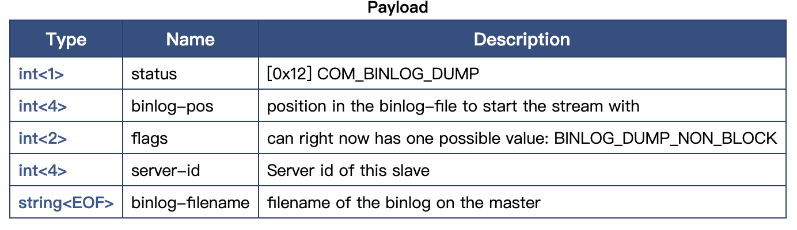
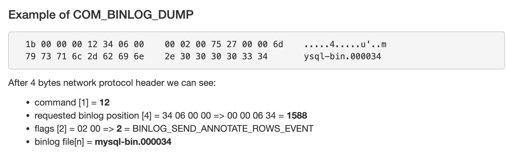
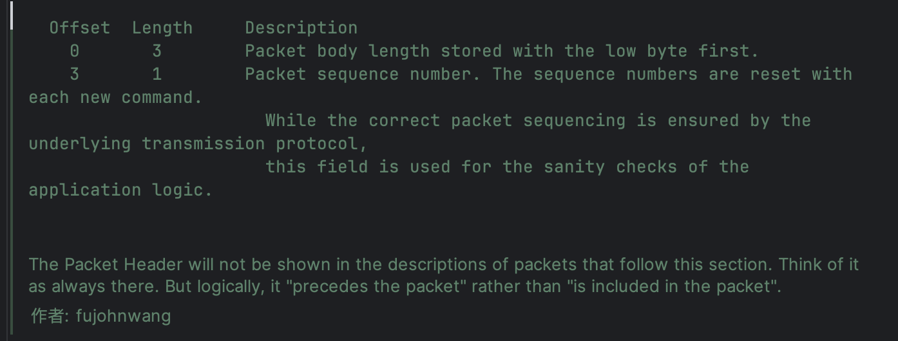
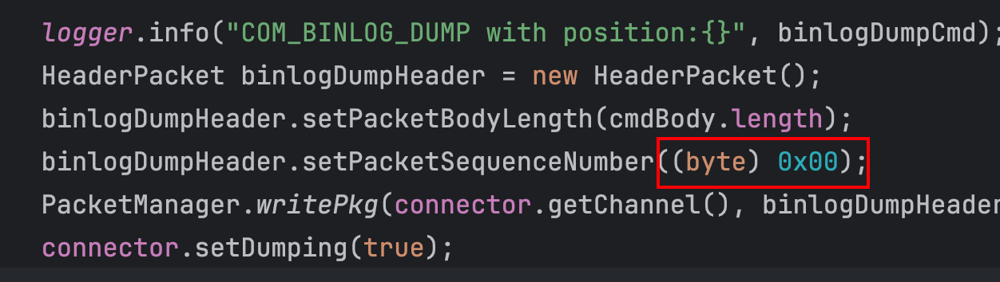

## 0. 前言

由于工作的关系，我需要大量的使用[go-mysql](https://github.com/go-mysql-org/go-mysql)的代码中关于复制的一部分。

作为一个曾经的DBA，也刚好对这部分内容感兴趣，所以就深入的研究了一下这部分的代码，现在将学习的笔记整理在此。

如果可能的话，顺手就连[alibaba canal](https://github.com/alibaba/canal)一起学了。

## 1. Binlog各类报文

首先考虑这样一个问题：我们要如何得到MySQL的Binlog，像Slave一样？

回答这个问题之前，先回忆一下如何将一个slave加入到集群里：

- 启动一个MySQL实例，执行`change master`语句，指定master的基本信息和binlog的基本信息；
- 执行`start slave`命令，开始复制。

这些操作其实就是一系列的网络请求，只需要了解其背后的报文格式，就可以实现。

先说说`change master`做了什么：发送了一个`COM_REGISTER_SLAVE`报文给master机器，这个报文的编码是`0x15`，也就是10进制的21。

这样就完成了注册操作，但是此时还不能开始dump binlog。接下来会给master发送一个`COM_BINLOG_DUMP`报文，这个报文的编码是`0x12`，也就是10进制的18。

大部分情况下，我们只需要关注这两种报文就可以启动一个进程来源源不断的获取binlog了。

### 1.1 COM\_REGISTER\_SLAVE

先来看看一个典型的`change master`语句：

```sql
change master to master_host='localhost', MASTER_PORT=3306, master_user='repl', master_password='repl', master_log_file='mysql-bin.000001', master_log_pos=0;
```

也就是说，在发送`COM_REGISTER_SLAVE`报文的时候，还需要携带一些关键信息上去。

看一下这个报文的结构。

| 字节数 | 说明 |
|:----|:----|
| 1 | 0x15 |
| 4 | serverId |
| 1 | hostname长度 |
| n | hostname |
| 1 | user name长度 |
| n | user name |
| 1 | password长度 |
| n | password |
| 2 | port | ​ |
| 4 | replication rank，忽略 |
| 4 | master id，给0 |


但是，这里需要注意，go-mysql里这个报文不是从位置0开始的，而是从4开始：

```go
pos := 4

data[pos] = COM_REGISTER_SLAVE
pos++
```

对于这一点，我是比较疑惑的，后来翻看了一下alibaba canal的相同代码，没有发现前4位有什么特殊的地方：


不过后来我发现MariaDB里有这样一个文档：

[https://mariadb.com/kb/en/com\_register\_slave/](https://mariadb.com/kb/en/com_register_slave/)


也就是说，前4位可能是一个类似于魔法数一样的东西。

这个问题留待以后再去探求。

### 1.2 COM\_BINLOG\_DUMP

完成注册以后，就可以开始DUMP binlog数据了。

这个报文有官方文档可以看，还是比较友好的：



这个报文基本都是定长数据，只有filename这一个变长数据。

但是，go-mysql里的cmd也是从位置4开始写的。还是从MariaDB处得到答案：



可见，前面4位确实是一类类似魔数的东西。

这个答案，在调试代码的还是发现了，其实这4位就是预留了Header的位置。

那么这个Header有什么呢？还是在alibaba的canal里找到了答案：



也就是前三位保存body的长度（小端序），第4位保存一个序列号，这个序列号在拼body的数据时候就已经置为0了，在alibaba canal里也是一样的处理方式：



### 1.3 COM\_BINLOG\_DUMP\_GTID

这个报文和之前的`COM_BINLOG_DUMP`有类似之处，都是启动binlog的dump操作，不同的是，这个报文是专门为了gtid而设计的。

比如这个命令：

```sql
change master to master_host='192.110.103.41',master_port=3106,master_auto_position=1; 
```

结构说明如下：

| 字节数 | 说明 |
|:----|:----|
| 1 | 0xef |
| 2 | 0x04 |
| 4 | server-id |
| 4 | binlog filename len，可以写成0，后面的file name就直接忽略掉，跳过不传即可 |
| n | file name |
| 8 | Pos，可以写死成4 |
| 4 | gtid data len |
| n | gtid data |


- go-mysql和alibaba canal对file name的处理是不同的，alibaba直接忽略了filename，并给file name length设置成了0。
- go-mysql和alibaba canal对pos的处理也不同，alibaba给了4。

实际上，从节约的角度来看问题，alibaba的处理更为优秀，在autoposition的设置下，fileName和Pos是无关紧要的东西。